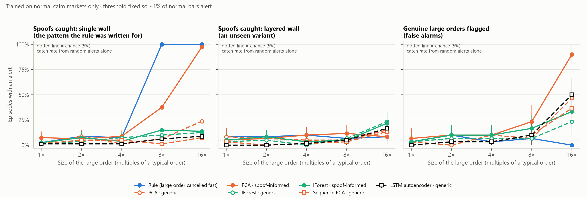
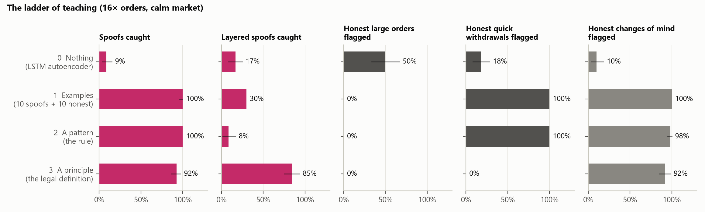

# Detecting the Unseen

**Can artificial intelligence detect hidden market manipulation without being taught what manipulation looks like?**

This is a preliminary experiment. I simulate a stock market's limit-order book and insert synthetic spoofing modelled on a real 2025 UK Upper Tribunal case. Then I test detectors that were trained **only on normal trading** and never shown a single example of spoofing.

> **Research-use constraint.** The spoofing agents exist only inside this offline simulation, for evaluating detectors. The project has no connection to any broker or exchange. An anomaly score is *not* evidence of illegal intent; at most it is a reason to look more closely.

---

## Quick start

```bash
python -m pip install -r requirements.txt
python -m pytest -q                  # order book, features, sequences and statistics
python run_experiments.py --fresh    # simulates ~1,100 sessions, fits detectors, writes results/
python run_experiments.py            # re-uses the simulated data in data/ (much faster)
python run_extensions.py             # market sensitivity, finer bars, individual orders
python run_teaching.py               # Part 2: the ladder of teaching (about 30 minutes)
python build_site.py                 # refreshes the website's data from the latest results
python -m http.server 8765 --directory docs --bind 127.0.0.1
```

Results land in `results/summary.md` (tables), `results/metrics.csv` (every number) and `results/figures/`.

*Why no scikit-learn?* On this laptop, Windows' Application Control blocks SciPy's compiled files, and scikit-learn needs SciPy. So Isolation Forest and PCA are written from scratch in NumPy (`src/isolation_forest.py`, `src/detectors.py`). That's a bonus: every algorithm here can be explained line by line.

---

## What's in each file

| File | What it does |
|---|---|
| `src/orderbook.py` | A limit-order book with price-time priority. Logs every ADD / CANCEL / TRADE like a real market-by-order data feed. |
| `src/market.py` | The agent-based market: noise traders, book-reading traders, market makers, an institution, plus the spoofer and the control agent. |
| `src/config.py` | Every setting in one place (market regimes, spoof sizes, thresholds). |
| `src/features.py` | Turns the event log into one row of features per "bar" (5 steps). It builds **two feature sets** (see below). |
| `src/isolation_forest.py` | Isolation Forest, following Liu, Ting & Zhou (2008). |
| `src/detectors.py` | Rule, generic/informed PCA and Isolation Forest, sequence PCA and a PyTorch LSTM autoencoder: seven configurations. |
| `src/orders.py` | Individual-order features and the order-level Isolation Forest experiment. |
| `src/accounts.py` | Part 2: what each account did in each 40-step window, and the principle detector built from the legal definition. |
| `run_teaching.py` | Part 2: examples, pattern and principle compared; honest changes of mind; stress tests. Writes `results/teaching.md`. |
| `run_extensions.py` | Market sensitivity, one-step resolution and order-level checks. |
| `src/evaluate.py` | Fair-scoring rules: fixed thresholds, chance levels, bootstrap confidence intervals. |
| `src/plots.py` | The figures. |
| `run_experiments.py` | Runs everything end to end. |
| `build_site.py` | Writes `docs/data/*.js` for the website: the results, plus two real spoofs replayed step by step. |
| `docs/` | The project website (served by GitHub Pages). Edit `docs/progress.js` to update the progress tracker. |
| `tests/` | Checks that the order book matches orders correctly, that Isolation Forest isolates outliers, that features are computed correctly, that account numbers never change the market, and that the principle scores spoofs, layering, market makers and two-account spoofers as the definition says. |

---

## How the experiment works

### 1. A market where spoofing can actually work
Spoofing only matters if other traders react to the order book, so the simulated market contains:
- **Zero-intelligence traders**, who ignore the book and trade around a noisy estimate of the asset's value.
- **Reactive traders**, who read the book. Heavy bids make them value the asset more and lean towards buying. This is a simplified version of the book-reading traders in Wang & Wellman (2017), and it's exactly what spoofing exploits.
- **Market makers**, who quote both sides and cancel/replace every 5 steps. Lots of fast cancellations are therefore *normal*.
- **An institution**, which now and then rests a *genuinely* large order behind the best price.

There are two **regimes**: *calm*, and *volatile* (a jumpier fundamental value and wider quotes).

### 2. Spoofing modelled on a real case
In *Urra, Lopez Gonzalez & Sheth v FCA* (Upper Tribunal, July 2025), traders:
- placed large orders that were visible but unlikely to trade, a tick or two behind the best price;
- put a small genuine order on the other side;
- cancelled the large orders within seconds, often right after the small order filled.

`market.py` reproduces that pattern:

| Episode | What happens |
|---|---|
| **spoof** | A single large "wall", 1–2 ticks behind the best price, plus a small genuine order on the other side. The wall is pulled when the small order fills, or after at most 30 steps. |
| **layer** | The same total size split over 4 price levels. This is **layering**, a variant the rule was not written for. |
| **honest** | The small genuine order with no wall. It runs on the *same random seed* as a spoof session, so the difference shows what the wall itself achieved. |
| **control** | A genuine large order of the same size and placement that stays on the book. If a detector flags these, it is detecting "big order", not "manipulation". |
| **reversal** | (Part 2) An honest trader rests the same large order, then changes their mind as if on news: they cancel it and trade a little the other way. Every action matches a spoof; only the intention differs. |

Wall sizes are swept over 1×, 2×, 4×, 8× and 16× a typical order.

### 3. Two feature sets: how much are we secretly "teaching" the detector?
- **Generic** (18 features): depth at the top 5 price levels on each side, spread, price change, and counts and volumes of adds, cancels and trades. This is the standard description used in order-book machine-learning papers, chosen *without thinking about spoofing*.
- **+ Spoof-informed** (6 more): largest single order, largest order cancelled within 50 steps, how far behind the best price the biggest order sat, book imbalance and its change, and signed trade flow. These encode what spoofing looks like, so they are a hidden form of teaching.

### 4. Detectors (main comparison fitted on NORMAL calm sessions only)
- **Rule**: "the largest order cancelled within 50 steps". Traditional surveillance logic, pure domain knowledge, no learning.
- **PCA**: learns the main patterns of normal bars. The score is how badly a bar is reconstructed from them (a linear autoencoder).
- **Isolation Forest**: the score is how easily random splits isolate a bar.
- **Sequence PCA and LSTM autoencoder**: reconstruct windows of eight bars; compare intact and shuffled sequences. The LSTM requires PyTorch (`torch`).

### 5. Fair scoring
- Each detector's alert threshold is the 99th percentile of its scores on separate **normal validation sessions**, so about 1% of normal bars alert. It is set before any spoofing data is looked at and never tuned afterwards.
- An episode is **caught** if any bar in its 8-bar window alerts. Spoofs and controls get identical windows.
- **Chance level**: how often a random 8-bar window in a normal session contains an alert anyway (about 6%). A catch rate near this is luck.
- Train, validation and test sets use **different simulated sessions** (different seeds), never neighbouring bars from the same session.
- Brackets in `summary.md` are 95% bootstrap confidence intervals.

---

## Preliminary findings from the main market



1. **Spoofing works in this market, so missing it matters.** Compared with its honest twin, an 8× wall raised the chance the spoofer's genuine order filled by **+12 points** (single wall) and **+15 points** (layered). It also shifted the price about 0.1 ticks in the spoofer's favour (`fig4`).
2. **The label-free models on generic features barely beat chance.** Isolation Forest caught 12% of even the largest (16×) single-wall spoofs, against a 6% chance level. PCA caught 24%. In a generic description of the book, a spoof is only mildly unusual.
3. **Adding spoof-informed features helped, but mostly by detecting *size*.** PCA with informed features caught 98% of 16× spoofs, but it also flagged **90% of genuine large orders** of the same size. It learned "big order", not "manipulation". This is a concrete example of *anomaly ≠ manipulation*.
4. **The rule was excellent, but only on the exact pattern it encodes.** It caught 100% of single-wall spoofs ≥ 8× while flagging 0–7% of genuine orders, because its alert threshold (17 lots) sits between the 4× and 8× spoof sizes. When the *same* spoof was **layered** into four 12-lot orders, each one fell under that threshold and the rule's catch rate fell to **8%**, about chance. PCA-informed collapsed in the same way (98% → 8%). Layered spoofs still worked (+15 points fill rate at 8×), so this is an **effective spoof that nothing here reliably catches**.
5. **Changing the market regime raises false alarms.** Across all six learned detector configurations, calm-trained models flag **11–51%** of normal volatile-market bars. The rule stays under 1%. Training on calm *and* volatile markets brings false alarms back to **1.5–2.1%**; see `results/summary.md` and website Figure 5 for the updated comparison.

**The starting hypothesis is not supported by this simulation.** The updated seven-detector comparison is in `results/summary.md`; follow-up experiments are in `results/extensions.md`. Sequence models and finer time bars did not resolve the spoof-versus-honest-order problem. At order level, the four-feature Isolation Forest has spoof-versus-genuine AUC 0.03 at 8× and 0.00 at 16× (`results/orders.csv`).

**The sensitivity check changes one conclusion:** generic PCA can catch substantially more spoofs in other simulated markets, so low catch rates are not a universal finding. It also flags honest large orders. The relevant question is whether suspicious orders can be distinguished from legitimate ones, not simply whether they trigger alerts. These findings concern the tested models and simulation, not every possible label-free detector.

---

## Part 2: what kind of teaching works?

Part 1 shows that learning only what normal trading looks like is not enough. Part 2 asks what a detector *should* be taught, and climbs a ladder of prior knowledge. Every rung is tested on the same spoofs (same seeds as Part 1), the same honest orders, and a new honest case built to be as hard as possible.



| Rung | What the detector is told | Spoofs caught, 16× | Layered caught, 16× | Honest large orders flagged | Honest quick withdrawals flagged | Honest changes of mind flagged |
|---|---|---|---|---|---|---|
| 0. Nothing | Learn normal trading (LSTM autoencoder) | 9% | 17% | 50% | 18% | 10% |
| 1. Examples | 10 labelled spoofs + 10 labelled honest large orders (logistic regression) | 100% | 30% | 0% | 100% | 100% |
| 2. A pattern | The rule: a large order cancelled quickly | 100% | 8% | 0% | 100% | 98% |
| 3. A principle | The legal definition, and no examples | 92% | 85% | 0% | 0% | 92% |

Two honest cases test what each rung really learned. A **quick withdrawal** is an honest trader placing a large order and cancelling it 5–25 steps later without trading: exactly what the rule looks for, but innocent. A **change of mind** is the same, followed by a small trade the other way: identical to a spoof in every action.

**The principle.** UK law (Market Abuse Regulation, Article 12) defines manipulation by its effect: orders that give false or misleading signals about supply or demand. `src/accounts.py` turns that into three questions about one account over 40 steps: did it *show* interest on one side (submit more there than on the other), was that interest *withdrawn* rather than traded, and did the same account *trade the other way*? If so, the score is the size of the false signal in lots. It mentions no size, timing or example of spoofing and learns nothing; only its alert threshold (10 lots) is set on normal trading. A market maker quotes both sides equally, so it shows no direction and scores zero however often it cancels.

It needs to know who placed each order, which regulators and exchanges hold (trading venues must keep client-identified order records under Commission Delegated Regulation (EU) 2017/580, "RTS 24") but the public order book does not show. The control is an untaught Isolation Forest given exactly the same account data.

Findings (`results/teaching.md`):
1. **Examples and patterns teach the look.** Shown only spoofs, the classifier learned "large order" and flagged 100% of honest large orders at 16×. Shown honest large orders too, it learned "large and short-lived", but still caught only 30% of layered spoofs at 16× and 0% at 8×, and it flagged every honest quick withdrawal at 16×, as did the rule. More examples (up to 40) changed nothing.
2. **The principle teaches the purpose.** With no examples it caught 81% / 92% of single-wall spoofs and 85% / 85% of layered spoofs (8× / 16×), and flagged 0% of honest large orders and 0% of honest quick withdrawals: cancelling quickly is not the offence, cancelling to help a trade on the other side is. Its misses were spoofs that never paid off: of spoofs whose small order traded, it caught 98–100%. On the same layered spoofs it beat the rule by +77 points at 16× (paired bootstrap, p < 0.001). Its false alarms went from 0.7% to only 0.9% of windows when the market turned volatile, where Part 1's learned detectors reached 11–51% of bars.
3. **It is the principle, not the data.** The untaught Isolation Forest on the same account data caught 0%. It ranked spoofers above honest large traders (AUC 1.00) but some honest trader was always stranger (AUC 0.00 against ordinary trading).
4. **Nothing separates a spoof from an honest change of mind** (principle AUC 0.50; the rule flagged 98%). Behaviour can show a signal was false, not why it was sent. That is a job for investigators, and it is why intent must be proved.
5. **Stress tests.** It held in all four alternative markets (76–96% of spoofs, 85–90% of layered spoofs at 16×, 0% of honest large orders or quick withdrawals) and whether 10 or 800 accounts per trader type were shared. Its real weakness is the omnibus account: inside a broker account carrying 20% of all orders it caught only 42% (8×) and 66% (16×).
6. **Attack: a spoofer with two accounts** (wall from one, small order from the other). Checked one account at a time: 0% caught. With accounts linked to their owner: 80% at 16×. Pairing every account with every other, without links: 100% of spoofs, but also 100% of honest quick withdrawals, at double the alert threshold. The third question ("did the same person trade the other way?") is what separates spoofing from honest cancelling, and only owner-linked account data lets a detector ask it.

---

## Limitations (stated up front)
- **I designed both the market and the spoofer.** The results describe this simulation, not real markets. Real order flow, latency and trader behaviour are far richer.
- **The rule's success is partly circular.** It was written with knowledge of the spoof pattern. The layering test exists to expose exactly that.
- **Sequence models have been tested, but the search is limited.** Sequence PCA and an LSTM autoencoder were tested at five-step and one-step resolutions. Their failure does not establish that all sequence models would fail.
- Small samples (80 spoof episodes per size), so the confidence intervals are wide at small sizes.
- The simplified agents have no learning, no inventory management and no strategic response to surveillance.
- **The principle detector was designed after Part 1**, by someone who knew how the spoofer worked. It encodes the legal definition rather than the spoofer's settings and was tested on layering, other markets and account structures it was not tuned for, but it is still one reading of the law. It relies on account data that only regulators and exchanges hold, and simulated accounts are cleaner than real ones.

## Next steps (Sixth Form plan)
1. **Attack the principle.** A spoofer who splits orders across linked accounts, or trades a little on the wall's side to look committed: what does evading the principle cost?
2. **More unseen variants**: slow spoofs (walls left longer than the rule's 50 steps), spoofs placed further from the touch, and an *adaptive* spoofer that tries to evade a given detector.
3. **Reality check**: compare the simulated spread, depth and imbalance distributions with the real FI-2010 order-book dataset.
4. **Wash trading**: a graph-based extension using simulated trader identities.

## References
- Urra, Lopez Gonzalez & Sheth v Financial Conduct Authority [2025], Upper Tribunal (Tax and Chancery Chamber), 1 July 2025.
- Regulation (EU) No 596/2014 (Market Abuse Regulation), Article 12 and Annex I, as retained in UK law.
- Commission Delegated Regulation (EU) 2017/580 (RTS 24) on the maintenance of relevant data relating to orders, as retained in UK law.
- Liu, F. T., Ting, K. M. & Zhou, Z.-H. (2008). Isolation Forest. *IEEE ICDM*.
- Wang, X. & Wellman, M. P. (2017). Spoofing the Limit Order Book: An Agent-Based Model. *AAMAS*.
- Wang, X., Hoang, C., Vorobeychik, Y. & Wellman, M. P. (2021). Spoofing the Limit Order Book: A Strategic Agent-Based Analysis. *Games* 12(2), 46.
- Leangarun, T., Tangamchit, P. & Thajchayapong, S. (2018). Stock Price Manipulation Detection using Generative Adversarial Networks. *IEEE SSCI*.
- Cao, Y., Li, Y., Coleman, S., Belatreche, A. & McGinnity, T. M. (2015). Adaptive Hidden Markov Model With Anomaly States for Price Manipulation Detection. *IEEE TNNLS* 26(2).
- Fabre, T. & Challet, D. (2025). Learning the Spoofability of Limit Order Books With Interpretable Probabilistic Neural Networks. arXiv:2504.15908.
- Ntakaris, A. et al. (2018). Benchmark Dataset for Mid-Price Forecasting of Limit Order Book Data with Machine Learning Methods. *Journal of Forecasting*.
- Cliff, D. (2018). BSE: A Minimal Simulation of a Limit-Order-Book Stock Exchange. arXiv:1809.06027.
